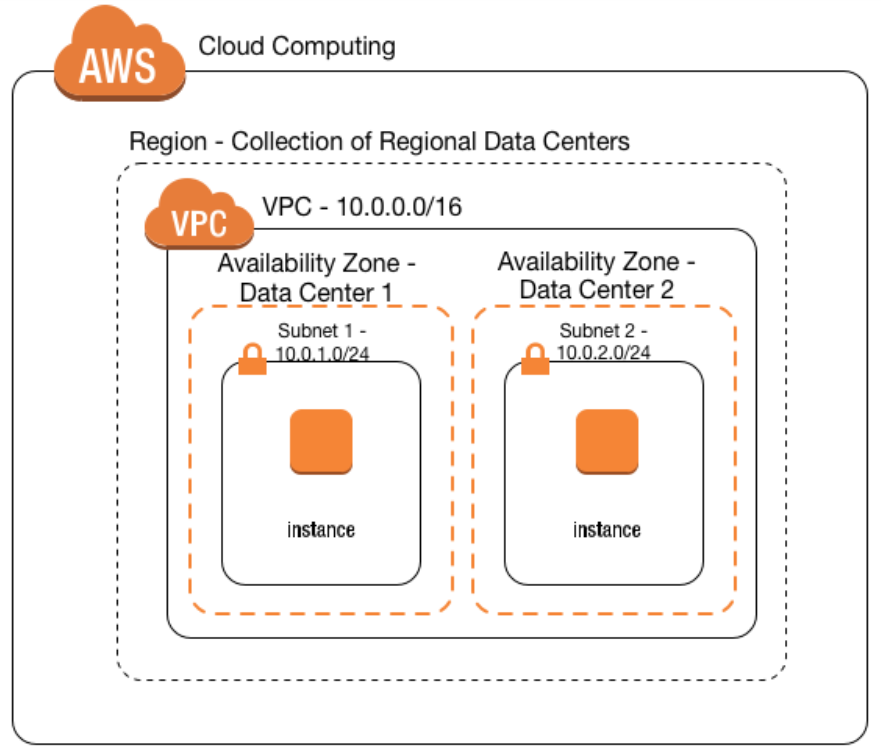
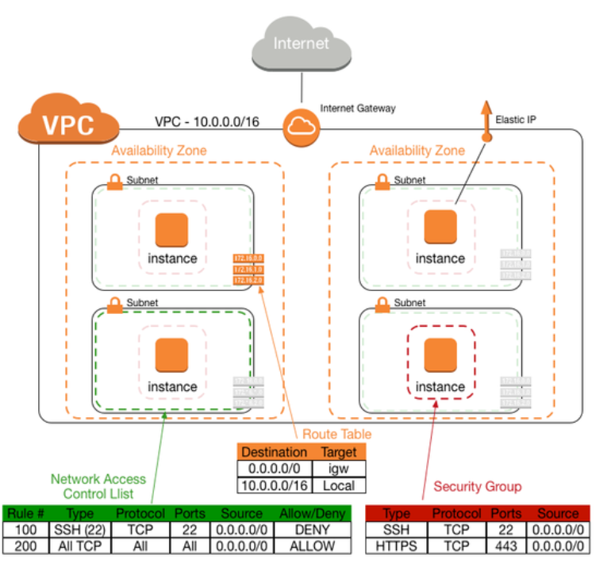
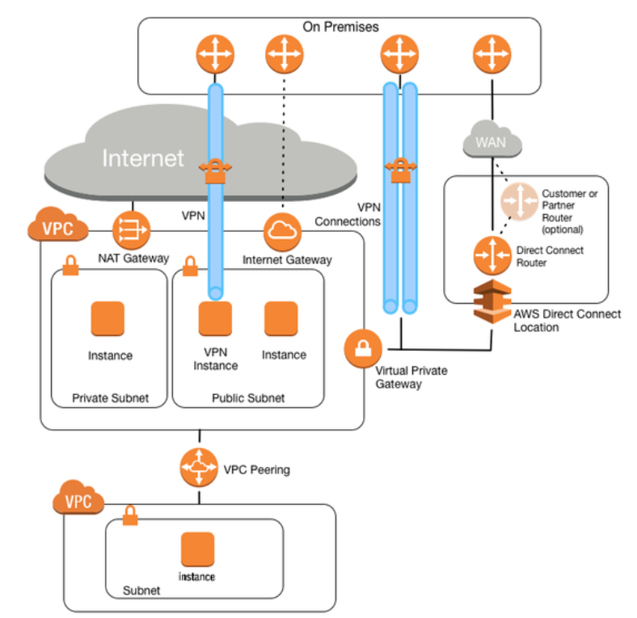

===
AWS
===

Amazon Web Services (AWS) is at the time of this writing (``2018-09-04``) the
largest provider of cloud services in the world. AWS offers a breadth of
services in both compute, storage, databases, serverless, CDN and
much more. The purpose of this section is to describe the networking
services in AWS and an overview of AWS networking.

--------------------------
Networking in AWS Overview
--------------------------

Networking in public cloud is quite different from an on-premises network.
In order to build a multi-tenant, scalable, fault tolerant and high speed
network, AWS has designed the network quite differently than a
"traditional" network. The most notable difference is:

* No support for multicast
* No support for broadcast

What this means is that routing protocols using multicast are not
supported without some form of tunneling but more importantly this means
that because broadcast is not supported, ARP requests are not flooded
in the network. Without ARP, how can a host learn the MAC address of
another host? This requires some magic. Which is performed by the
hypervisor. When the hypervisor sees an ARP request, it will proxy
the ARP response back to the host. More about the specifics of networking
in AWS later.

----------------
AWS Fundamentals
----------------

^^^^^^^^
Instance
^^^^^^^^

With AWS terminology, a virtual machine (VM) is called an instance.

^^^^^^^^^^^^^^^^^
Availability Zone
^^^^^^^^^^^^^^^^^

An Availability Zone (AZ) is one or several datacenters in the same
geographical area sharing infrastructure such as power and internet transports.

^^^^^^
Region
^^^^^^

A `region <http://aws.amazon.com/about-aws/global-infrastructure/>`_ is a
collection of AZs. The number of regions is always growing and currently
there are regions in North America, Europe, Asia, and South America.

All regions consist of at least two AZs, some three and some even four. 
To provide high availability, applications should be deployed in more than
one AZ.

Some of AWS' services are regional and some are global.

^^^
VPC
^^^

Virtual Private Cloud (VPC) is one of the foundational building blocks
of AWS. VPC is a virtual datacenter deployed in AWS' multi-tenant cloud.
By default, all instances deployed in AWS, are deployed to a default VPC.
The default VPC is designed to help organizations start quickly. For that
reason, the instances will by default get a public IP assigned, and have
a route to the internet by default. This is not true for customer created
VPCs.

These are actions that are performed in the default VPC:

* Creates a VPC with a /16 CIDR block (172.31.0.0/16)
* Creates a /20 subnet in each AZ
* Creates an internet gateway and attaches it to the VPC
* Creates a route table with a default route (0.0.0.0/0) pointing to the IGW
* Creates a default security group (SG) and associates it with instances in the VPC
* Creates a Network ACL (NACL) and associates it with the subnets in the VPC
* Associates the default DHCP options set for the AWS account with the default VPC

The default security group has the following logic:

* Allows all inbound traffic from other instances associated with the same SG
* Allows all outbound traffic

The default NACL allows all traffic both inbound and outbound.

^^^^^^
Subnet
^^^^^^

When a VPC is created, it must have a subnet in order to be able to address
the instances. For the default VPC, 172.31.0.0/16 is used. For customer
created VPCs, the user will assign a subnet ranging from a /16 up to a /28.

Subnets are always specific to an AZ, but there can be several subnets in
an AZ.

Note that some addresses in a subnet are reserved for use by Amazon.
For example, in the subnet 192.168.0.0/24, the following addresses would be 
reserved:

* 192.168.0.0   - Network address
* 192.168.0.1   - Reserved by AWS for VPC router
* 192.168.0.2   - Reserved by AWS for DNS server
* 192.168.0.3   - Reserved by Aws for future use
* 192.168.0.255 - Broadcast address

So what does a VPC look like? This image from Amazon's blog shows the
VPC construct:

^^^^^^^^^^^
Route Table
^^^^^^^^^^^

Every subnet needs a route table, by default a subnet gets assigned to a
default route table. It is also possible to create custom route tables.
A route table can be associated with multiple subnets but every subnet
can only belong to one route table. 

It is common practice to have private and public subnets and using
different route tables for each. The public subnet would then have
a public IP or elastic IP and be reachable from the internet while
the private subnet wouldn't be, at least not without first passing
an NAT gateway or instance.

Note that routes always point to some form of gateway or endpoint, such as an
internet gateway (IGW), NAT gateway, virtual gateway (VGW), EC2 instance,
VPC peer or VPC endpoint and not towards an IP address directly.

It's important to know that forwarding can't be changed for local traffic, 
that is traffic inside of the VPC. It's not possible to override this
behavior with a longer route so routing in a VPC is not strictly
longest prefix matching (LPM).

^^^^^^^^^^^^^^
Security Group
^^^^^^^^^^^^^^

A security group is similar to a stateful ACL or a basic form of firewall, 
albeit distributed. The SG is applied to the instance directly and keeps 
track of TCP, UDP and ICMP connection status. Rules are white list only,
consisting of ACL entries, and contain an implicity deny, meaning that
anything not permitted, is denied. A SG can reference another SG, for
example a database SG allowing any instance in the application SG to
send traffic inbound on the port that the database service is exposing.

Note that an instance can be associated with several SGs, and that all
rules would be evaluated before permitting or denying a flow. It's possible
to change the SG applied to an instance after it has been launched.

^^^^^^^^^^^
Network ACL
^^^^^^^^^^^

The Network ACL (NACL) is a stateless ACL, applied at the subnet level.
Logically, any traffic going to an instance, will be evaluated in the
NACL first, before being evaluated by the SG. NACLs are ordered and
can have both permit and deny statements. It's only possible to reference
CIDR ranges and not instances or other ACLs.

For example, to deny all SSH traffic into a subnet, a NACL could block
TCP port 22 inbound instead of putting rules in each SG. 

^^^^^^^^^^^^^^^^^^^^^^^^^
Elastic Network Interface
^^^^^^^^^^^^^^^^^^^^^^^^^

The elastic network interface (ENI) is a virtual network interface card (NIC).
An instance can have multiple ENIs and an ENI can be moved to another instance
within the same subnet. It's also possible to have multiple addresses assigned
to an ENI. An ENI has a dynamically assigned private IP and optionally a public
one as well.

^^^^^^^^^^^^^^^^^
Public IP Address
^^^^^^^^^^^^^^^^^

Public IP addresses are addresses that are reachable from the internet. AWS
uses two types of public IP addresses:

* Dynamically assigned public IP addresses
* Elastic IP addresses

If the instance does not need to have a persistent public IP, it can use
the public IP (dynamically assigned). This IP is however released if the
instance terminates. For instances needing a persistent IP, use the Elastic
IP instead. Note that this IP comes with a cost when not assigned to an
instance.

^^^^^^^^^^
Elastic IP
^^^^^^^^^^

The Elastic IP is not dynamically assigned but rather statically assigned
to instances that need a persistent IP address. It can be associated with
another instance if the first one is terminated.

Having a persistent IP can simplify writing ACLs, DNS entries and having
the IP address whitelisted in other systems. Note that there is always
a private IP assigned to the instance, this is the one that is seen
when looking at the OS level. This holds true for both dynamically assigned
addresses and the Elastic IP. The private IP address remains the same
unless the EIP is moved to another instance.

How can the instance have a private IP but still be publically accessible?
NAT. AWS will perform 1:1 NAT so that the instance can be reached from the
outside.

The VPC then, with added details, looks like below, once again the picture
from Amazon's blog.

--------------------------------
External Connectivity to the VPC
--------------------------------

There are multiple ways to connect to a VPC but keep in mind that a VPC
does not do transitive routing. This picture, from Amazon's blog, shows
the different options of connecting to the VPC.

^^^^^^^^^^^^^^^^
Internet Gateway
^^^^^^^^^^^^^^^^

The internet gateway (IGW) provides access to the internet. This device
is provided by Amazon, is highly available and is used by pointing a default
route at the IGW. The IGW is a regional service

^^^^^^^^^^^
NAT Gateway
^^^^^^^^^^^

The NAT gateway is a service provided per AZ, used for translating private
IP addresses into public ones. This is mainly used for instances that need
to reach the internet, for example for downloading software updates, but that
should not be reachable from the outside. The devices having ther private
IP addresses being translated, will share a single Elastic IP.

As noted above, because it is a service provided per AZ, if multiple AZs
are leveraged, use one NAT gateway per AZ.

^^^^^^^^^^^^^^^^^^^^^^^
Virtual Private Gateway
^^^^^^^^^^^^^^^^^^^^^^^

The virtual private gateway (VGW) is a regional service, highly available, that
terminates two AWS services:

* Virtual Private Networks (VPNs)
* AWS Direct Connect

The VGW terminates IPSec tunnels and can either use static routing or
Border Gateway Protocl (BGP) for dynamic routing. It's also possible
to propagate routes learned dynamically into the VPC.

Direct Connect circuits point to the VGW which is the entry point into
the VPC.

^^^^^^^^^^^^^^^^^^^^^^^
Virtual Private Network
^^^^^^^^^^^^^^^^^^^^^^^

VPNs are provided through the VGW, as noted above or by having an instance
terminate the VPN. For example by using AMIs from networking vendors such
as Cisco, Palo Alto and others. A VGW can never setup a tunnel to another
VGW. This is because a VGW is always only a responder, never the initiator.

Only 100 routes are supported to be added into the VPC through the use of
VPNs.

-----------------------------
Other Interesting Information
-----------------------------

^^^^^^^^^^^^^^
Virtual Router
^^^^^^^^^^^^^^

There is a "virtual" router attached to the VPC. In reality, this is a
distributed service provided by both HW and a hypervisor, of course.

^^^^^^^^^^^^
DNS in a VPC
^^^^^^^^^^^^

DNS is handled by the VPC by default. Every instance is assigned a DNS name
with its IP address, automatically managed by AWS. It's possible to use Route53
to setup a private zone as well or using an instance hosting the DNS service.

^^^^^^^^^^^^^^^^^^^^^
Routing and Switching
^^^^^^^^^^^^^^^^^^^^^

* AWS only supports unicast traffic, no multicast or broadcast. As described previously, ARP responses are proxied by the hypervisor
* Traffic between subnets in a VPC is allowed, unless restricted by a security group, NACL or filtered at the host
* Traffic between two instances in the same VPC is always local and can't be overridden with more specific routes
* Traffic that is not sourced by or destined to an instance is dropped, unless disabling the source/destination check
* Transitive routing is not supported, meaning that VPC A can't communicate with VPC C by going through VPC B
* Jumbo frames are supported inside of a VPC but traffic leaving a VPC always uses a Maximum Transmission Unit (MTU) of 1500 bytes

.. sectionauthor:: Daniel Dib
