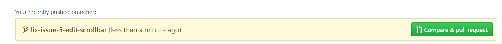
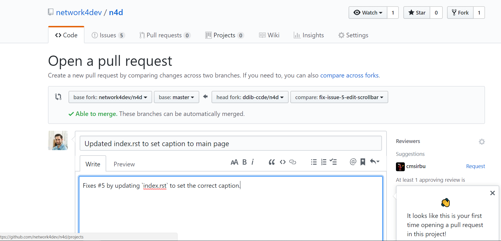

============
Contributing
============

This site was created to be open for contributions from the open-source
community. This is achieved by commiting files to Github in ``.rst`` format.

In order to contribute to this site, the following is needed:

* Github account
* Github client
* Text editor
* (optional) Local install of Sphinx

By leveraging Github, multiple people can write documents for the site
without having to use a platform like Wordpress using many different
accounts.

-------------
Architectures
-------------

N4D chapters are based on architectures. At the start these are:

* Cloud
* Datacenter
* Design
* Networking
* Security
* Services

These are quite self-explanatory but the following adds more context to
each architecture:

**Cloud** - Focus on networking in the public cloud, such as AWS, Azure and GCP.

**Datacenter** - Focus on on-premises datacenter technologies and design.

**Design** - Focus on networking design principles such as scalability, fault
domains and more.

**Networking** - Focus on "standard" networking such as LAN and WAN.

**Security** - Focus on security such as firewalls, IPSec and more.

**Services** - Focus on networking related services such as DNS and DHCP.

-------------
N4D structure
-------------

N4D, using Read the Docs, thus using Sphinx as the backend, has the following
structure setup:

* ``docs`` - All the documents go here
* ``_static`` - All static content, such as images, go here

In order to keep things sorted, there are also subdirectories based on
different architectures, for the ``docs`` directory these are:

* Cloud (``docs/cloud``)
* Datacenter (``docs/datacenter``)
* Design (``docs/design``)
* Networking (``docs/networking``)
* Security (``docs/security``)
* Services (``docs/services``)

The ``_static`` directory also has the same layout:

* Cloud (``docs/_static/cloud``)
* Datacenter (``docs/_static/datacenter``)
* Design (``docs/_static/design``)
* Networking (``docs/_static/networking``)
* Security (``docs/_static/security``)
* Services (``docs/_static/services``)

--------
Workflow
--------

This site uses a `forking <https://www.atlassian.com/git/tutorials/comparing-workflows/forking-workflow>`_
workflow, meaning that each contributor forks the official repository to create
their own server-side copy of the project. This allows the maintainers to
keep write access for the maintainers and instead approving incoming
Pull Requests.

--------------------------
Setting up the environment
--------------------------

The first step to contributing is to create a fork of the `N4D <https://github.com/network4dev/n4d>`_ repository.
This is done by clicking the ``fork`` icon in the top right corner. 

.. image:: _static/Fork.png

When this is done, clone the forked repo to a local directory.

.. code-block:: console

  daniel@demo:~/n4d-fork$ git clone https://github.com/ddib-ccde/n4d.git
  Cloning into 'n4d'...
  remote: Counting objects: 22, done.
  remote: Compressing objects: 100% (16/16), done.
  remote: Total 22 (delta 2), reused 18 (delta 1), pack-reused 0
  Unpacking objects: 100% (22/22), done.

When using the forking workflow, the upstream repository needs to be added.

``git remote add upstream https://github.com/network4dev/n4d.git``

The command ``git remote -v`` can be used to verify the origin and upstream
repo.

.. code-block:: console

  daniel@demo:~/n4d-fork/n4d$ git remote -v
  origin  https://github.com/ddib-ccde/n4d.git (fetch)
  origin  https://github.com/ddib-ccde/n4d.git (push)
  upstream        https://github.com/network4dev/n4d.git (fetch)
  upstream        https://github.com/network4dev/n4d.git (push)

-----------------
Contributing text
-----------------

Before committing any text, it's recommended to make sure that your local
copy of the repo is up to date. This is accomplished by fetching from
the upstream master and merging it with your local copy.

If you are already synched, it will look like in the demo below.

.. code-block:: console

  daniel@demo:~/n4d-fork/n4d$ git fetch upstream
  From https://github.com/network4dev/n4d
  * [new branch]      master     -> upstream/master
  daniel@demo:~/n4d-fork/n4d$ git checkout master
  Already on 'master'
  Your branch is up to date with 'origin/master'.
  daniel@demo:~/n4d-fork/n4d$ git merge upstream/master
  Already up to date.

Before working on a document, create a branch and name it appropriately,
such as ``osi-model-text`` with ``git checkout -b osi-model-text``.
Using your text editor, edit the file and then commit the changes
``git commit -a -m "Wrote about the OSI model``. Then the commit
is pushed to origin, using ``git push origin osi-model-text``. When
pushing to Github, you will need to supply your credentials.

The demo below shows an update to the scrollbar for N4D:

.. code-block:: console

  daniel@demo:~/n4d-fork/n4d$ git checkout -b fix-issue-5-edit-scrollbar
  Switched to a new branch 'fix-issue-5-edit-scrollbar'
  daniel@demo:~/n4d-fork/n4d$ git commit -a -m "Updated index.rst to set caption to main page"
  [fix-issue-5-edit-scrollbar d5ac8bf] Updated index.rst to set caption to main page
  1 file changed, 1 insertion(+), 1 deletion(-)
  daniel@demo:~/n4d-fork/n4d$ git push origin fix-issue-5-edit-scrollbar
  Username for 'https://github.com': ddib-ccde
  Password for 'https://ddib-ccde@github.com': 
  Counting objects: 3, done.
  Delta compression using up to 2 threads.
  Compressing objects: 100% (3/3), done.
  Writing objects: 100% (3/3), 324 bytes | 324.00 KiB/s, done.
  Total 3 (delta 2), reused 0 (delta 0)
  remote: Resolving deltas: 100% (2/2), completed with 2 local objects.
  To https://github.com/ddib-ccde/n4d.git
  * [new branch]      fix-issue-5-edit-scrollbar -> fix-issue-5-edit-scrollbar

Once the commit has been pushed to your forked repo at Github, you
can submit a PR to upstream. By navigating to your forked repo at Github,
Github will see that you have pushed a new branch, in order to create a
PR from the branch, click on ``compare & pull request``. 

When this is done, it will look like the picture below.

If this PR is a fix to an issue, this can be indicated in the text, as it
is in this example with "Fixes #5". Issues can be referenced by putting
the hash sign followed by the number of the issue.

When the PR has been opened, it will look like the picture below.

.. image:: _static/PR-opened.PNG

The PR will then have to be approved by one of the maintainers before it
will be merged to upstream.

-------------------------------
Brief intro to reStructuredText
-------------------------------

reStructuredText (reST) is the default plaintext markup language used by 
Sphinx. People familiar with Markdown will recognize some of the syntax.

First in every ``.rst`` document is the header. This is created by using
equal sign above and below the text, like below::
  
  =================
  This is a heading
  =================

^^^^^^^^^^^^^
Inline markup
^^^^^^^^^^^^^

* one asterisk: \*text* for italics
* two asterisks: \**text** for boldface
* backquotes: \``text`` for code samples

Below is a sample of what it looks like:

* *italics*
* **boldface**
* ``code sample``

^^^^^^^^^^
Hyperlinks
^^^^^^^^^^

To put a hyperlink in the text, use the following syntax:

\`Link text <https://domain.invalid/>`_ 

^^^^^^
Images
^^^^^^

Images are referenced with the image directive, like below::

  .. image:: static_/my_image.png

Remember to put a blank line before and after this directive.

^^^^^^^^^^^^
Code samples
^^^^^^^^^^^^

It is supported to highlight different code examples, for example output
from console with::

  .. code-block:: console

It looks like the output below:

.. code-block:: console

  daniel@demo:~/n4d-fork/n4d/docs$ ls
  audience.rst  changelog.rst  contributing.rst  design  infrastructure.rst  networking  services
  _build        cloud          datacenter        images  introduction.rst    security    _static

It is also possible to highlight programming languages such as Python.

For a more complete guide, refer to 
`reStructuredText Primer <http://www.sphinx-doc.org/en/master/usage/restructuredtext/basics.html>`_

To test your syntax, it's possible to use 
`Online reStructuredText editor <http://rst.ninjs.org/>`_

If unsure of the syntax, check one of the existing files in the ``docs`` directory.

------------------
Local Sphinx build
------------------

It is also possible to install Sphinx locally to test out your changes, this
process is described `here <https://github.com/network4dev/n4d/blob/master/README.md>`_

Note that you should clone your forked repo if you want to be able to push changes
upstream.

------
Issues
------

If there is an issue with the site, an article or if you need support. Open an
`issue <https://github.com/network4dev/n4d/issues>`_ by clicking ``New issue``.

